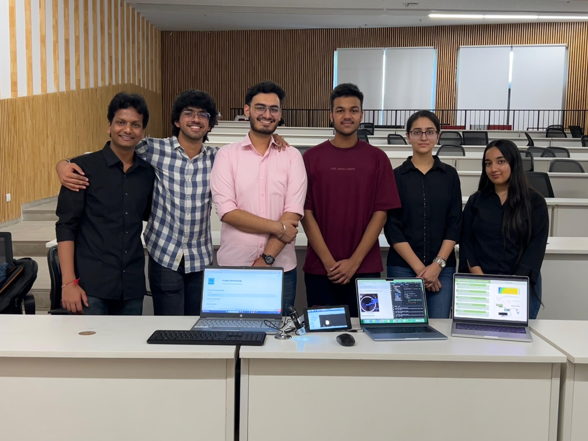
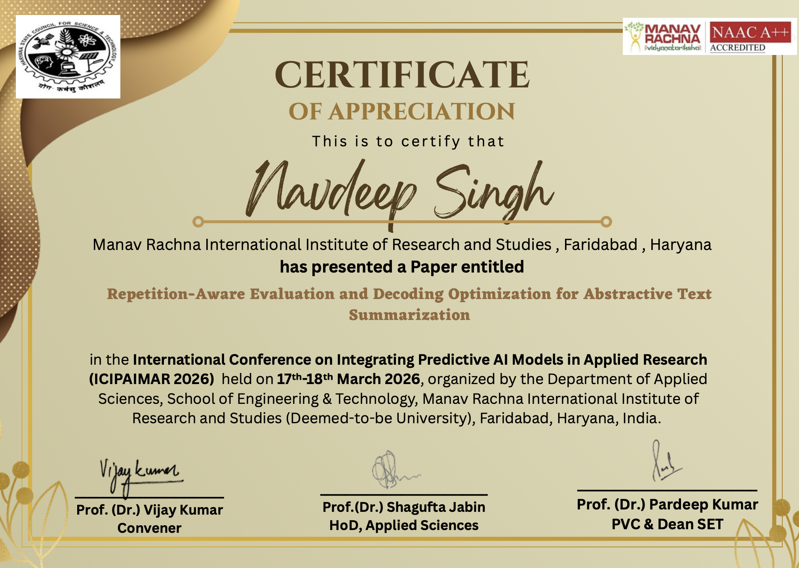

<div align="center">

<!-- Animated Header -->


<!-- Typing Animation -->
<a href="https://git.io/typing-svg">
  
</a>

<br/>

<!-- Social Badges -->
[](https://linkedin.com/in/navdeep--singh0)
[](https://github.com/NavdeeepSinghh)
[](https://github.com/NavdeeepSinghh)

</div>

---

## 🧠 About Me

```python
navdeep = {
    "name"       : "Navdeep Singh",
    "username"   : "NavdeeepSinghh",
    "college"    : "Thapar Institute of Engineering & Technology",
    "degree"     : "B.E. Computer Science",
    "location"   : "Patiala, Punjab 🇮🇳",
    "passion"    : ["Machine Learning", "Full-Stack Dev", "Open Source"],
    "currently"  : "Building cool stuff & learning every day 🚀",
    "ask_me_about": ["Python", "ML", "TypeScript", "Data Science"],
}
```

---

## 🛠️ Tech Stack

<div align="center">

**Languages**


**ML & Data**


**Web & Tools**


</div>

---

## 🚀 Featured Projects

<div align="center">
<a href="https://github.com/NavdeeepSinghh/ML_Disaster-Prediction-Model">
  
</a>
<a href="https://github.com/NavdeeepSinghh/RozgarNow">
  
</a>
</div>

---

## 📊 GitHub Stats

<div align="center">

<br/>


<br/>

<!-- Activity Graph -->
[](https://github.com/ashutosh00710/github-readme-activity-graph)

</div>

---

## 🏆 GitHub Trophies

<div align="center">


</div>

---

## 🐍 Contribution Snake

<div align="center">


</div>

---

<div align="center">

<!-- Profile views counter -->


<!-- Footer wave -->


*"Code is like humor. When you have to explain it, it's bad." — Cory House*

</div>
